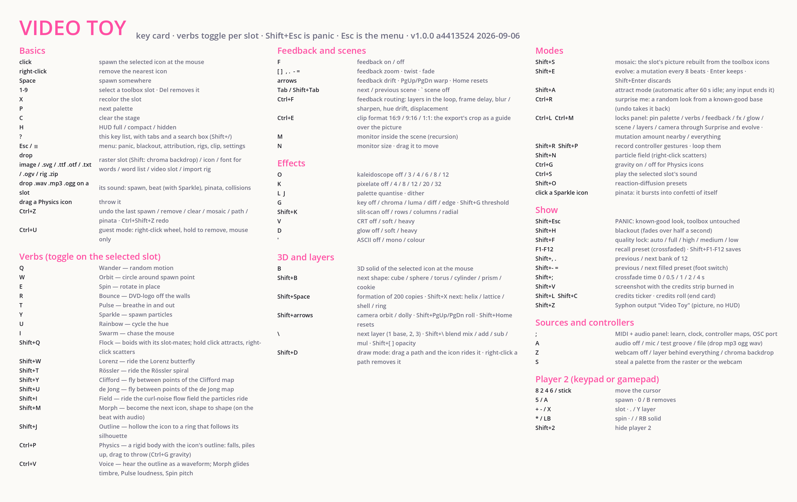

# Video Toy

[](https://github.com/TheMutantFactory/video-toy/actions/workflows/test.yml)

A Godot 4.7 toy for streams, VODs and Knobcon: search [The Noun Project](https://thenounproject.com)
for icons, drop them into a Minecraft-style hotbar, give them **verbs** (wander, orbit, spin,
bounce, pulse, sparkle, rainbow, swarm), pick a **palette**, turn on **video feedback**, and post-process with **kaleidoscope**, **chroma key**,
**pixelate**, **palette quantise** and a **CRT** pass. Press **M** for a monitor inside the scene
that shows the scene, and watch it recurse. Press **B** for 3D solids wearing the icons.

```bash
./run.sh            # play
./run.sh test       # headless smoke tests + screen self-test (no network, no quota)
./run.sh capture    # screenshot every screen into out/ (./run.sh capture a,b to pick shots)
./run.sh check      # capture the deterministic reference shots and pixel-diff them against tests/reference
./run.sh reference  # re-record the reference shots after an intentional visual change
./run.sh keycard    # regenerate docs/key-card.png + docs/KEYS.md from src/keys.gd
./run.sh export     # build out/Video Toy.app (macOS) and self-test the bundle
```

Needs Godot 4.7 (`GODOT=/path/to/godot` if it isn't on PATH or in /Applications).

## The app

`./run.sh export` builds `out/Video Toy.app` from `export_presets.cfg`: universal, ad-hoc
signed (enough for your own machines; notarize before handing it to strangers), App Sandbox
**off** (the clip render spawns a process, rig import uses a file dialog, Syphon and the OSC
socket live outside it), with the microphone and camera usage strings macOS needs before it
will show a permission prompt — an exported app without them never asks. The export also
stamps `build.json` (git hash + date) into the bundle; the start screen, Settings and the
credits text show it. The target then runs the bundle's own binary through the self-test.

Settings has a **Microphone input** switch: on a machine with no audio input device the
input setting silences all audio, and an exported app has no `run.sh` to write the override,
so the switch writes `override.cfg` beside the executable (or into the project from the
editor). It takes effect on the next launch.

## Modes (start screen)

| Mode | What it does |
| --- | --- |
| Find Icons | Type a word, browse free thumbnails, click to inspect the license, **Add to toolbox** (one metered download). Keep exploring: more pages, new words. |
| Play | Click to spawn the selected icon. Verbs are toggles per slot and apply live to every actor from that slot. |
| Scenes | Shader sources (plasma, warp, truchet, voronoi, blobs) and oscillators (ramp, bars, rings, noise) as a layer behind everything, crossfaded. |
| Settings | Quality lock, OSC port, Syphon server name, autosave and attract timers, HUD at start, clock at launch, microphone input, reference-diff thresholds (`user://settings.cfg`, most applied live), and the Noun Project API key/secret (`user://noun_credentials.cfg`). |
| Attribution | Paginated list of every asset ever downloaded, with icon and creator links. Also on **Esc** / **☰** from any screen. |
| Load demo shapes | Five built-in shapes so the toy plays with no API key. |
| Add word | Type a word on the start screen (or in Find Icons): it is rendered white-on-alpha like an icon, so it tints, gets verbs, wraps solids and extrudes. |

### Play keys

[](docs/key-card.png)

The one-page card above and [docs/KEYS.md](docs/KEYS.md) are generated from `src/keys.gd` by
`./run.sh keycard` (the smoke test fails when they drift). The same list is the in-app help:
**?** (Shift+/), the **? Keys** button or the Esc menu open an overlay with a tab per group and
a search box; Esc closes it. **H** cycles the HUD full / compact / hidden. [docs/SHOW.md](docs/SHOW.md)
is the show manual: setup checklist, panic and blackout, restore after a crash, credits at the end.

## Scenes, oscillators, warp mesh

A **scene** is a shader that runs as a layer behind everything in the world, so icons fly
over it and feedback, effects and the monitor wrap it. Five art scenes and four oscillator
primitives (ramps, bars, rings, noise — Lumen's building blocks) share one system and one
palette. **Tab** cycles them in Play with a crossfade; the Scenes screen shows live previews.
Three knobs — speed, scale, colour bias — are learnable params; next/previous/off are actions.

The feedback "previous frame" is drawn through a **warp mesh**: a 32×18 grid whose vertices a
shader displaces Milkdrop-style. Warp amount and speed, drift (pushed in every pass), and
stretch are learnable; arrows / PgUp / PgDn / Home drive them from the keyboard.

## 3D: extruded icons, formations, camera

The **cookie** shape (Shift+B) extrudes the icon itself: its alpha becomes a slab, the faces
carry the icon texture so the silhouette stays smooth, the sides take the body colour, and
holes survive. **Shift+Space** spawns a formation — 200 copies of the selected icon in the
current shape as one MultiMesh, per-instance colours walking the palette ring — in a helix,
lattice, Fibonacci shell or ring (Shift+X). The **camera** orbits, dollies, rolls and rises from
Shift+arrows / Shift+PgUp/PgDn, and all four are learnable params; "slow orbit" is an action.

## Layers and drawing

Three **layers**: layer 1 is the world; layers 2 and 3 are transparent viewports whose actors
composite into it through a blend mode (mix, add, subtract, multiply) and an opacity — so
feedback, effects and the monitor see the blend. `\` picks the layer you spawn into; Shift+`\`
and Shift+`[` `]` set its blend and opacity; both are learnable and saved in presets.

**Draw mode** (Shift+D): drag a path and the selected icon rides it — resampled, closed if the
ends meet, one rider per ~110 px looping at 170 px/s. Riders keep spin, pulse, rainbow and
sparkle; right-click a path to remove it. Paths live in the active layer.

## Keyers and slit-scan

**G** cycles the keyer: *chroma* keys the palette background; *luma* keys dark pixels;
*diff* keys whatever did not move since the last frame, so only motion shows; *edge* keeps
Sobel outlines. Keyed pixels show the backdrop (Shift+drop an image, the webcam, or the
palette plasma). Shift+G steps the threshold; mode and threshold are learnable and preset-saved.

**Shift+K** cycles slit-scan: the last 36 pre-effects frames (every 2nd frame, about 1.2 s)
live in a ping-pong atlas, and the picture is reassembled with time running down the rows,
across the columns, or outward from the centre. It sits inside the chain, so kaleidoscope,
quantise and the CRT still apply on top.

## Mosaic, evolve, attract

**Mosaic** (Shift+S) rebuilds the selected slot's picture from the toolbox: a photo picks the
icon whose palette colour is nearest each cell and scales it by brightness; an icon or word is
built from its own shape. The cells are ordinary actors, so Bounce explodes the picture and
Orbit makes it breathe around home.

**Evolve** (Shift+E) is the Electric Sheep loop: every 8 beats (or 6 s without audio) the stage
mutates — a verb, the palette, an effect step, feedback, glow, scene, keyer, slit-scan, a layer
blend or the camera. Enter keeps the mutation, Shift+Enter reverts it; an unvoted mutation
stands. All of it is learnable, so two pads can be the vote.

**Attract** (Shift+A, or 60 s idle) recalls a random saved preset every 20 s — three mutations
when none are saved — with a slow camera orbit and the monitor on. Any key, click, MIDI or pad
ends it and restores the stage as it was. It is the screensaver and the table demo.

## Icon distance fields: Morph and Outline

Every icon gets a **signed distance field** (an 8SSEDT distance transform of its alpha at 200 px,
cached in `user://icons/sdf`), and a shader draws shapes from it with crisp edges at any scale.
The **Morph** verb (Shift+M) blends the icon's field into the next icon's in the toolbox — a star
becomes a heart — then steps on to the next, every 1.5 s or, with audio on, in two jumps per
beat. The **Outline** verb (Shift+J) hollows the icon to a ring that follows its silhouette;
both together outline the morph.

## Timeline and attractors

**Shift+R** records every param and action that arrives through the controllers (MIDI, pads,
OSC — audio-driven params are skipped) for up to 60 s; **Shift+P** loops it back through the
same dispatch, so a knob sweep you performed becomes an LFO. Saved to `user://timeline.json`.
Record and loop are learnable actions.

Four **attractor verbs**: Lorenz and Rössler are integrated each frame and the icon rides the
curve (3D solids trace them in 3D); Clifford and de Jong are iterated maps the icon glides
between. With feedback fade high they paint the attractor.

## Particle field, Field verb, reaction-diffusion

**Shift+N** turns on 12,000 GPU dots riding a curl-noise flow field, pulled toward the mouse
and the icons (or pushed away — the attract param runs from −1 to 1; right-click empty space
scatters them for a beat). Flow and attract are learnable; the dots take palette colours by
speed. The **Field** verb (Shift+I) puts icons on the same field.

**Shift+O** cycles Gray-Scott **reaction-diffusion** presets. It runs in two 480×270
viewports that alternate each frame, the world's icons seed the V chemical, and the pattern is
painted through the palette *under* the actors — so icons grow coral, spots or worms around
themselves. Feed and kill are learnable; everything is preset-saved.

## Show safety: frame rate, auto-quality, panic, blackout

The HUD shows fps against the display's refresh rate and the smoothed **work** per frame —
script time plus Godot's measured CPU + GPU render time across every viewport, so a vsync wait on
a 30 Hz display does not read as slowness. A **quality ladder** (full / high / medium / low)
sheds load — particle count, reaction-diffusion rate, slit-scan stride, glow taps, 3D
anti-aliasing — and steps down by itself after a second over 20 ms of work, back up after five
seconds under 12 ms, with a three-second cooldown. **Shift+F** locks a level (or Settings → Quality,
or `./run.sh play low`).

**Shift+Esc** is **panic**: every effect, feedback, particles, reaction-diffusion, scene, monitor,
webcam, layer blend, camera, draw / evolve / attract / timeline off, glow soft — toolbox and actors
untouched. **Shift+H** is a **blackout** that fades over half a second. Both are in the Esc menu
and are learnable actions, so a pad can be the emergency stop.

## Credits: export, ticker, roll, burned-in screenshots

The Attribution screen (Esc) has **Copy credits** (the ledger as a text block on the clipboard,
ready for a VOD description) and **Save credits.txt** (`user://credits.txt`). On the stage,
**Shift+L** shows a one-line **ticker** naming every icon currently on the picture, **Shift+C**
runs a **credits roll** of the whole ledger over the picture as an end card, and **Shift+V**
saves a **screenshot** of the picture (no HUD) with a strip listing the on-stage credits burned
in — CC BY on a thumbnail. All three are learnable actions.

## Syphon output and MIDI clock

**Shift+Z** publishes the composite — the picture, no HUD — as a Syphon server named
"Video Toy" for OBS, Resolume, VDMX or any Syphon client, through the vendored
[godot-syphon](https://github.com/buresu/godot-syphon) GDExtension (MIT; macOS, Forward+/Metal
only; binaries in `addons/godot-syphon`). The capture run reads the server back through a client
to prove it. Windows would want Spout instead.

A **MIDI clock** (24 ppqn with start / stop / continue) or the **internal clock** (an action in
the `;` panel, BPM a learnable param) drives every beat-driven thing — sparkle bursts, Morph,
evolve, the pulse — through the same beat path as the audio detector. While a clock runs, the
timeline loop's length rounds to whole bars and playback waits for the next bar, and "lock
scenes to BPM" ties the oscillator scenes' speed to the tempo. The HUD shows source, BPM and
the beat in the bar.

## Birthday extras

- **Any SVG** dropped on Play is whitened like a Noun icon and tints with the palette.
- **Any font**: drop a `.ttf` / `.otf` and every later word uses it.
- **Emoji** work in words (the system emoji font; colour is kept, so they are untinted).
- **Word lists**: drop a `.txt`; each line becomes a word slot while there is room, otherwise one
  slot that **cycles** through the words on the beat (every 2 s without a beat source).
- **Live words**: type `clock` for the time, or `countdown 23:59` for a countdown to the next
  23:59 that ends in 🎉; they re-render every second.
- **Video slots**: drop a Theora `.ogv` and it plays, looping, as an animated slot (convert with
  `ffmpeg -i in.mp4 -c:v libtheora -q:v 7 -an out.ogv`).
- **Pinata**: click an icon that has Sparkle on and it bursts into confetti of itself; the
  learnable *pinata* action does it to a random one.

## Undo and Surprise me

**Ctrl+Z** undoes the last spawn, remove, clear, mosaic, drawn path or pinata — a stack of
twelve live states, contents only, so the look you dialled in afterwards stays. **Ctrl+Shift+Z**
redoes. **Ctrl+R** (or **Surprise me** on the start screen and in the Esc menu) builds a random
look from a known-good base: panic, a random palette, usually a scene, eight icons if the stage
is empty, six evolve mutations, feedback more often than not. It is one undo step, so the guest
who pressed it can take it back. Undo, redo and surprise are learnable actions.

## MIDI out, over OSC

Godot has no MIDI output, so the toy sends **notes and events as OSC** (Settings → **OSC out**,
default `127.0.0.1:9001`, live; also an action). Spawns are notes on channel 1 — the same
pentatonic ladder by slot the Voice verb sings, from A2, velocity by height — collisions on
channel 2 with velocity by impact, pinatas on channel 3 an octave up, every beat a kick on
channel 10; each note gets its note-off after a short gate. Alongside, `/vt/event/spawn`,
`collision`, `pinata`, `remove` and `beat` carry the raw facts for any OSC host.
[docs/controllers/osc-midi-bridge.py](docs/controllers/osc-midi-bridge.py) (`pip install mido
python-rtmidi`) turns the `/vt/midi/*` family into a virtual MIDI port named "Video Toy" for
a synth or DAW; the full list is in `docs/controllers/osc-addresses.txt`.

## Voice: the icon as an oscillator

The **Voice** verb (**Ctrl+V**) makes the icon audible: its silhouette's radius around the
centre, read off the distance field at 512 angles, is one cycle of the waveform — a star is a
five-bump tone, a bolt a ragged buzz, a heart something in between (a circle, being flat, falls
back to the field's ring, then a sine). Each icon is one oscillator through an
`AudioStreamGenerator`, pitched by its slot on a pentatonic ladder from A2 with a little
detune per copy, and quieter the more of them sing. **Morph** glides the timbre toward the
next icon as the shape glides, **Pulse** is loudness, **Spin** bends the pitch a quarter octave,
and the beat lifts everything. The shape you see is the wave you hear.

## Guest mode and the tour

**Ctrl+U** (Settings → Guest mode for launch, the Esc menu, an action) is mouse-only play for
a party: a **tap spawns**, **holding** on an icon for half a second **removes** it, and
**right-click opens a wheel** around the cursor — a ring of the toolbox slots as coloured icons,
a ring of verbs with their on / off marks, and a ring of actions (palette, surprise, feedback,
3D solid, formation, scene, glow, undo, clear, panic). Click the hub or scroll to change ring;
right-click or click outside closes. Physics grabs, the monitor drag and draw mode still work.

The first time Play opens, **five captions** walk a newcomer through spawning, the toolbox,
verbs, effects and presets, and the help key; click or Space advances, Esc skips, and it never
comes back unless Settings → Tour or Esc menu → **Take the tour** asks for it. Captures and
self-tests never see it.

## Feedback routing

**Ctrl+F** opens the loop's routing. Each layer has an **in the loop** switch: a layer taken out
of the loop is composited *over* the feedback instead of feeding it, so a crisp title can ride
on top of the trails, or the drawing layer can stay clean while everything else smears. The
**frame delay** reads the loop from up to 23 frames back (a half-resolution history ring, so a
delayed loop also softens — a video-delay look), and every pass through the loop can **blur or
sharpen**, **drift the hue**, **push the saturation**, and be **displaced** by a texture: the
picture itself, layer 2, layer 3 or the webcam — draw into layer 3 and warp the loop with it.
All of it snapshots and crossfades, panic clears it, the HUD names what is on, and the delay,
blur, hue and displacement are params with the layer switches and the source as actions.

## Lock and mutate

**Ctrl+L** opens the locks panel: pin **palette, verbs, feedback, fx, glow, scene, layers** or
**camera**, and Surprise me and evolve vary everything else — the locked sections ride through a
surprise untouched (it says "kept …" in the HUD). **Ctrl+M** cycles the **mutation amount**:
nearby (one small mutation, small nudges) through to everything (six). Locks and the amount
persist in settings, show in the HUD, and are learnable actions and a param, so a pad row can
be "keep the colours, change the rest".

## Physics and sounds

The **Physics** verb (**Ctrl+P**) turns the icon into a rigid body with its own outline
(`BitMap.opaque_to_polygons` on the icon's alpha, cached per texture and scale): it falls, bounces
off four walls around the picture, spins on impact and piles up with the others. Other motion verbs
step aside while it is on; Pulse, Rainbow and Sparkle still run, and every collision bursts a few
copies of the icon. **Drag** a physics icon to throw it. **Ctrl+G** turns gravity off (floating
billiards) and on; gravity is a learnable param, a snapshot / preset value that crossfades, and
the HUD says when it is off.

Drop a **.wav / .mp3 / .ogg on a hotbar slot** and that slot has a sound (copied into
`user://sounds`, exported with the rig, marked ♪ on the tile): it plays on spawn, on the beat
when the slot has Sparkle (once per beat however many are on stage), at pinata, on physics
collisions (louder for harder hits, a little pitch spread) and by hand with **Ctrl+S** or the
"play sound" action. Nine slots, nine samples. Dropped anywhere else the file is still the
audio-reactivity source.

## Two-player

A second person plays from the **numeric keypad** or a **gamepad**, with their own slot,
layer and on-screen cursor. Keypad 8/2/4/6 or the left stick moves the cursor; 5 / Enter / A
spawns their slot at it into their layer (layer 2, additive, by default); 0 / B removes the
nearest; + − / X cycle their slot; . / Y cycles their layer; * / LB toggles Spin on their slot;
/ / RB spawns a 3D solid. Any of those wakes player 2; Shift+2 hides them. Their slot gets a
cyan ring on the hotbar. The toolbox and verbs are shared, so both players shape the same set.

## Presets

**Shift+F1..F12** saves everything the stage remembers (palette, feedback, warp, effects, glow,
monitor, webcam, shape, camera, layers, particles, reaction-diffusion, scene, every slot's verbs
and colours) into the current **bank** (eight banks, Shift+, and Shift+.); **F1..F12** recalls.
A recall **crossfades everything**: continuous values lerp over the fade time (Shift+; cycles
0 / 0.5 / 1 / 2 / 4 s, also a learnable param) and discrete values flip at the midpoint.
**Shift+-** / **Shift+=** step to the previous / next filled preset in the bank — a foot switch —
and a **preset morph** param scrubs from the last recalled preset toward the next one. Bank,
next / previous preset and bank are all learnable, so a pad row can be a set list. Old preset
files load as bank 1.

The **Sparkle** verb emits small copies of the icon itself (2D and on 3D solids); with audio on
it also bursts on every beat.

## MIDI-learn (Knobcon)

Press **;** in Play. Every MIDI input is opened on launch (Rescan after plugging in). Click a
row, then move a knob or hit a pad: that message is bound to it. Right-click a row to unbind.

- **Params** (knobs, faders, velocity-sensitive pads, pitch bend, 0..1): feedback zoom /
  twist / fade, pixelate size, kaleidoscope, CRT, monitor size, palette, toolbox slot.
- **Actions** (pads, buttons, or a CC crossing 64): spawn icon, spawn 3D solid, clear,
  feedback, next palette, chroma, quantise, dither, monitor, next shape, recolor, select
  slot 1-9, toggle each verb on the selected slot.

Bindings live in `user://midi.json`. The HUD shows the last message received.

**Templates** (`docs/controllers/`, regenerated by `./run.sh templates` from the live tables):
`video-toy.touchosc` / `video-toy.tosc` — a TouchOSC layout with a fader per param and a button per
action, addressed `/vt/param/<id>` and `/vt/action/<id>` so a phone is a full surface with no
learning (set the OSC host to the toy's IP, port 9000); `launchpad.json` (programmer mode) and
`apc-mini.json` — grids of slots, verbs, presets and show actions, loaded with the **Launchpad
map** / **APC mini map** buttons in the `;` panel (merged over your bindings); and
`osc-addresses.txt` for any other surface.

**Gamepads** learn the same way: sticks and triggers are params (sticks map -1..1 to 0..1 with
a centre deadzone), buttons are actions (or 1/0 params). **OSC** listens on UDP 9000
(`VIDEO_TOY_OSC_PORT` to change): `/vt/param/<id> <0..1>` and `/vt/action/<id>` drive things by
name with no learning, and any other address (`/1/fader3` from TouchOSC, say) is learnable like a
CC. The `;` panel lists connected pads and the OSC port.

## Modulators: motion without patching

Every param row in the **;** panel has a **~** button: click it to cycle a modulator through
sine, triangle, square, saw, a random walk, sample-and-hold and a beat envelope (right-click
cycles the rate: 0.1 to 4 Hz; S&H and the envelope also retrigger on the beat), and the slider
beside it is the depth. The modulator swings around the last value the knob sent, so a MIDI
fader sets the centre and the LFO breathes around it — the research doc's "drag a modulator
onto a parameter, adjust its depth beside the control", minus the drag. Modulators are saved
with the controller map (so with the rig), the HUD counts them, and panic leaves them alone.

## Audio reactivity

Press **A** to cycle the source: **mic**, a built-in **test** groove (120 BPM, no input
needed), or a **file** (drop an mp3/ogg/wav on the window; it plays and loops). Four bands
(bass, mid, high, level) and a beat detector come out of it:

- With audio on, the **Pulse** verb follows the bass and everything jumps a little on the beat.
- In the **;** panel, the **♪** button on any row binds it to a band: params follow
  bass/mid/high/level, actions fire on the beat. Feedback zoom on bass and Spawn on beat is
  the obvious first patch.
- **Audio gain** is itself a param, so a knob can set the sensitivity.

The mic is analysed on a silent bus and never played back. macOS asks for microphone
permission the first time you switch to mic.

**No input device?** Godot 4.7 needs `audio/driver/enable_input` for the mic, and on a machine
with no input device at all that setting makes CoreAudio fail and *all* audio goes silent.
`./run.sh play` checks for an input device on macOS and writes a gitignored `override.cfg`
that turns input off when there is none (the HUD says so; test groove and file still work).
Plug in an interface and run again to get the mic back.

## Raster and webcam

Drop a PNG / JPG / WebP on the window and it becomes a toolbox slot: verbs, spawning and 3D
solids all work on it, and it keeps its own colours (Rainbow still shifts them). The file is
copied to `user://raster/` and listed in Attribution as a local image. **Shift+drop** makes
it the chroma-key backdrop instead.

**Z** cycles the webcam: as a *layer* it sits behind everything in the world, so it goes
through feedback, effects and the monitor — point the camera at the screen and you have a
real feedback loop; as a *backdrop* it shows through the chroma key. Godot's CameraServer
handles RGB and YCbCr feeds; macOS asks for camera permission the first time. The HUD says
"no camera" if there is none.

**S** steals a palette: k-means over the selected raster (or the live webcam frame), darkest
cluster as background, the rest as the ring sorted by hue. Stolen palettes join the P cycle
and persist in `user://palettes.json`.

## Credentials

Resolved in this order (same as [noun-project-utils](https://github.com/TheMutantFactory/noun-project-utils)):

1. `NOUN_KEY` / `NOUN_SECRET` environment variables
2. `user://noun_credentials.cfg` (the Settings screen writes this)
3. `~/.config/noun/credentials.cfg` — plain INI, `[noun]` section with `key=` and `secret=`

Search and quota checks are free. Adding an icon to the toolbox is the only metered call.

## Layout

```
main.tscn / src/main.gd     screen router, --selftest, --capture
src/menu_overlay.gd         ☰ / Esc menu + paginated Attribution
src/start_screen.gd         modes
src/search_screen.gd        Noun Project search → inspect → add
src/stage_screen.gd         play: the coordinator — render graph, layers, drawing, input, keys, HUD;
                            one-line delegations to the modules below (class_name Stage)
src/stage/fxrig.gd          particle field, reaction-diffusion, quality ladder, panic, blackout
src/stage/state.gd          snapshots, presets and banks, the crossfade of everything, morph
src/stage/controls.gd       the param / action tables, control dispatch, timeline, clock ticks
src/stage/media.gd          webcam, video slots, live and cycling words, mosaic, file drops, Syphon
src/stage/modes.gd          evolve and attract
src/stage/players.gd        player 2
src/stage/credits.gd        credits ticker, roll, burned-in screenshots
src/stage/world3d.gd        3D solids, formations, camera
src/stage/layers.gd        three actor layers, blend / opacity compositing, draw mode strokes
src/stage/input.gd          mouse (spawn, grab, drag, strokes) and the keyboard as a keycode -> [plain, Shift] table
src/glow.gd + glow.gdshader bloom pass before fx
src/fx.gd + fx.gdshader     post-process: CRT, kaleidoscope, pixelate, chroma key, quantise, dither
src/presets.gd              eight banks x twelve stage snapshots, user://presets.json
src/state_lerp.gd           crossfade maths: continuous fields lerp, discrete flip at the midpoint
src/quality.gd              the quality ladder + frame-time monitor
src/rig.gd                  rig export / import (zip of user:// state and assets)
src/autosave.gd             live-state autosave + running flag
src/ascii.gd + ascii.gdshader   ASCII mode (glyph atlas from TextRaster)
src/image_diff.gd + tests/diff.gd   capture comparison for ./run.sh check; references in tests/reference
src/clock.gd     (autoload) MIDI clock in / internal clock: bpm, beats, bars
addons/godot-syphon         vendored Syphon GDExtension (MIT), macOS Forward+
src/shot.gd                 screenshot + burned-in credits strip
src/scenes.gd + scene_layer.gd + scenes/*.gdshader   scene table, crossfading layer, the shaders (common.gdshaderinc shared)
src/feedback_mesh.gd        the warp mesh under feedback: subdivided quad + vertex-warp shader
src/text_raster.gd          a word -> white-on-alpha Image via the TextServer glyph atlases (CPU, headless-safe); fonts + colour emoji
src/live_text.gd            clock / countdown words
src/boids.gd                flocking maths (2D and 3D) for the Flock verb
src/attractors.gd           Lorenz, Rössler, Clifford, de Jong (pure functions)
src/sdf.gd + morph.gdshader signed distance fields (8SSEDT) and the Morph / Outline shader
src/field.gd + particles.gdshader   curl-noise flow field (CPU for the verb, GPU for 12k dots)
src/rd.gdshader             Gray-Scott step (ping-ponged by the stage, composited in _worldmix)
src/p2_cursor.gd            player 2's cursor
src/timeline.gd             record / loop of controller gestures
src/ride_path.gd            a drawn stroke as a Curve2D with looping riders
src/mosaic.gd               image -> grid of cells with colour / luminance (for Shift+S)
src/extrude.gd              icon alpha -> extruded "cookie" mesh (textured faces + plain sides)
src/formation.gd            200 copies in a helix / lattice / shell / ring as one MultiMesh
src/monitor.gd              the TV inside the world that shows the final composite
src/solid.gd                a 3D shape wearing an icon; lives in a 3D viewport composited into the world
src/actor.gd                one icon on stage; verbs read live from Toolbox
src/hotbar.gd               the 9-slot bar
src/toolbox.gd   (autoload) slots + verbs, user://toolbox.json
src/ledger.gd    (autoload) attribution ledger, user://attribution.json
src/noun_api.gd  (autoload) OAuth 1.0a client (pinned to RFC 5849 vector)
src/icon_media.gd(autoload) thumbnails + white SVG rasteriser
src/palettes.gd             named colour sets
src/verb.gd + src/verbs.gd  the Verb base class and the registry (discovers res://verbs at load)
verbs/*.gd                  one file per verb: metadata + move2d / post2d / move3d / post3d / formation hooks
src/midi_map.gd  (autoload) the learn table: MIDI, gamepad, OSC and audio bands -> params/actions, user://midi.json
src/osc.gd       (autoload) OSC over UDP: listener, message/bundle codec, /vt/param and /vt/action routes
src/templates.gd            TouchOSC (.touchosc / .tosc) layouts and Launchpad / APC mini maps from the tables
docs/controllers/           the generated templates
src/midi_panel.gd           the MIDI + audio panel on the stage
src/audio_react.gd (autoload) mic / file / test groove -> bass, mid, high, level, beat
src/webcam.gd               CameraServer feed (RGB or YCbCr) as a sprite; rendered to a viewport on the stage
demo/                       built-in shapes
docs/RESEARCH.md            video toys, feedback, shader art, 3D, raster — the roadmap
```

## Autosave, ASCII, clips

The live state — the snapshot plus every icon and solid on stage — is autosaved every 30 s.
If the last run did not exit cleanly, the start screen offers **Restore last session**.

**'** (apostrophe) cycles **ASCII mode**: the picture redrawn as a grid of glyphs picked by
luminance, in the palette accent or in each cell's own colour; it runs after every other effect.

**Render 20 s clip** (Esc menu, or `./run.sh clip 20`) uses Godot's Movie Maker: a second Godot
launches with `--write-movie`, restores the autosave, hides the HUD, plays the timeline loop if
there is one, and writes an AVI (MJPEG + WAV) at a fixed 60 fps to `user://clips/` — offline, so
it never drops frames. Convert with `ffmpeg -i clip.avi -c:v libx264 -crf 18 clip.mp4`.

## Safe mode and crash logs

`./run.sh safe` (or `open -a "Video Toy" --args --safe`, or Settings → **Safe mode**) launches
with **no MIDI, OSC, camera or microphone**: the MIDI ports stay closed, the OSC socket is never
bound, the camera server is never asked to monitor (which is what makes macOS ask for the
camera), and the mic source is unavailable. The HUD and the start screen say SAFE. For the
machine that misbehaves an hour before the show.

Godot writes a log per run to `user://logs/` (ten kept, rotated by timestamp). When the last
run did not exit cleanly, the start screen's restore row gains **Crash log** (the previous run's
error lines and tail, inline), **Open log** and **Copy log**; Settings has **Open logs**.
`./run.sh test` ends with a `--safe --safecheck` launch that proves all four inputs stay off.

## Loop-maker export

Settings → **Clip export** picks a **format** — 16:9, 9:16 or 1:1, a centre crop of the
picture — and **Ctrl+E** on stage shows that crop as a guide so the shot can be composed for it.
Esc → **Render the loop** renders exactly the timeline loop's length (**Shift+R** to record a
loop of gestures; 20 s without one) after a **pre-roll** that warms the feedback, in a second
Godot at a fixed frame rate, at the crop's size. If **ffmpeg** is on the machine the parent
then makes an **mp4** (h264 / aac): the pre-roll trimmed, and for a loop the first **seam**
second cross-dissolved from the frames that follow the loop's end, so the end meets the start.
Without ffmpeg the AVI stays and a `.sh` with the exact command is written beside it. The HUD
reports each stage. `./run.sh clip [s] [9:16]` does the render from the shell.

## Rig files

The Esc menu has **Export rig**, which zips the toolbox and every asset it points at, the
attribution ledger, presets and banks, controller bindings, palettes, the timeline loop, the
current font and the chroma backdrop into `user://rigs/`, and **Import rig…** (or drop a rig
`.zip` on Play), which unpacks one and reloads everything. "Send me your Knobcon rig."

## CI

[.github/workflows/test.yml](.github/workflows/test.yml) runs on every push and pull request:
`./run.sh test` (smoke + self-test) on headless Linux with a colour emoji font installed, and on
macOS the `./run.sh export` build with its in-bundle self-test, uploading `Video-Toy-macOS.zip`
as an artifact for two weeks — the latest app is always one download away. Captures and the
pixel-diff references stay local (`./run.sh check`); they need a GPU and a window.

## Reference captures

`tests/reference/` holds PNGs of nine deterministic shots (five screens, the control panel and
the help overlay over an empty stage, and two seeded stage shots with pixelate + quantise, one
with the CRT). `./run.sh check` re-captures them and
compares each at 240×135 — mean difference and worst 8×8 block — so a HUD digit passes and a
broken shader fails; `./run.sh reference` re-records them after an intentional change.

## Adding a verb

A verb is one file in `verbs/` extending `Verb`: set `id`, `name`, `key` (`"⇧K"` with `shift = true`
for a shifted key), `hint`, and optionally `order` (motion order), `group` (only the first active
verb of a group moves) and `sets_rotation`. Implement any of `move2d(actor, delta) -> bool`
(return true if you moved the base position), `post2d`, `move3d(solid, delta)`, `post3d`,
`formation(formation, delta)`. Hosts expose `position`, `velocity`, `home`, `bounds`, `t`,
`frame_scale` (multiply it), `active_ids`, `beat_hit`, `audio_active()`, `audio_bass()`,
`beat_env()`; verb files must not reference autoloads. Drop the file in and it appears in the
verb panel, the learn table and the controller templates.

## Licensing

Most Noun Project icons are CC BY. The ledger keeps the attribution string and license for every
download, and the Attribution screen shows it in-app. Keep it visible in anything you publish.
